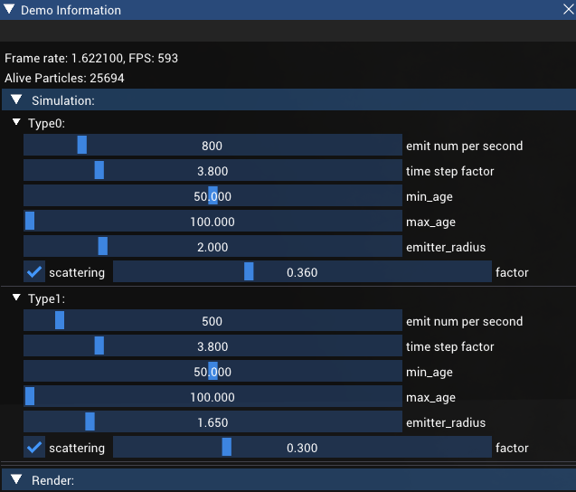
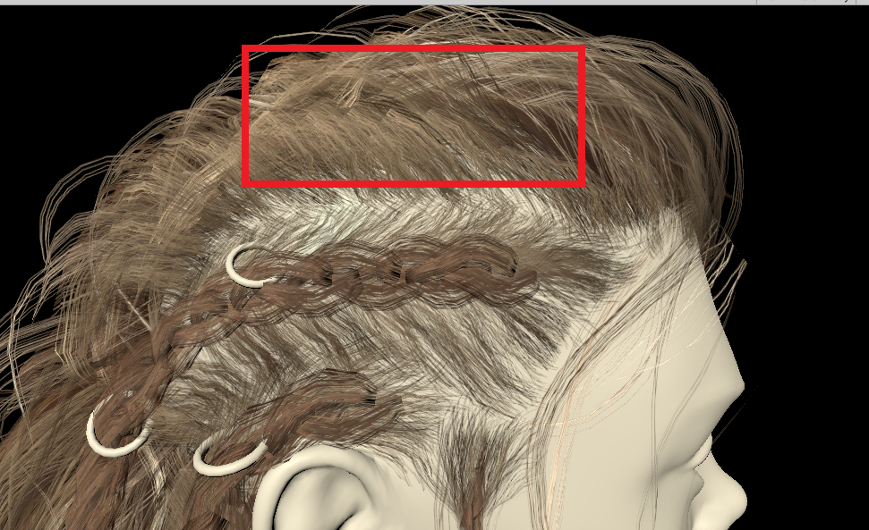

### 使用粒子系统进行烟雾模拟
实现基于 GPU 的粒子系统，使用 ShaderStorageBuffer 存储粒子的状态信息，并在
ComputeShader 中更新，充分利用 GPU 的并行计算能力。使用半透明烟雾粒子纹理，结合 Screen-Aligned 公告板实现烟雾效果。

### 在UnitySRP渲染管线上实现基于链表的OIT算法,并渲染头发
# 简介
渲染半透明物体时需要先排序，然后从后往前进行渲染，基于链表的OIT算法在GPU中对片段进行排序再混合，是一种效率较低的OIT算法，但是可以将其作为Groud Truth。基本思路是：使用头指针纹理和用于储存片段信息的缓冲组成链表。第一个Pass：首先正常渲染不透明物体，然后开启提前深度测试，渲染透明物体但不写入缓冲，而是将透明片段信息储存在链表上。第二个Pass：将第一个Pass的渲染结果作为背景，对每一个像素的所有片段按照深度排序，按照Over操作混合得到最终的颜色。
# 注意事项
为了索引头指针纹理，可以用裁剪空间坐标计算屏幕空间坐标。但在第一个Pass中，当渲染到纹理并且处于DirectX平台时，unity会翻转投影矩阵，此时用裁剪空间坐标计算屏幕空间坐标比较麻烦，可以直接在Fragment Shader中访问SV_POSITION拿到屏幕空间坐标。第二个Pass，可以正常通过裁剪空间坐标计算屏幕空间坐标，并且因为是渲染一个Quad，纹理坐标*屏幕长宽就是屏幕空间坐标。

 不使用OIT会有面片重叠的边界出现
